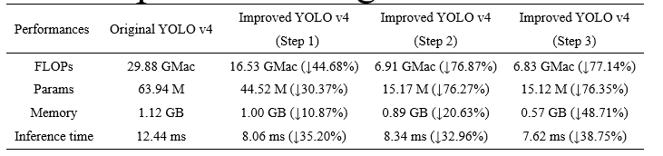

# Improved-YOLOv4
&emsp;In order to solve the problems of poor robustness of traditional computer vision algorithms, and also the low inference speed and high computational cost of deep learning methods, an improved YOLO v4 algorithm with lightweight parameters for strawberry flowers detection was proposed in this paper. 
## Environment
* Nvida GeForce RTX 2080TI x1
* CUDA 10.0
* CUDNN 7.0
* Ubintu 18.04
* python 3.6
* pycharm 2021.3.21

## Methods
### Step 1: backbone network lightweight design
* The backbone of original YOLOv4 was substituted by a new one which uses the grouped convolution to replace the traditional convoluton to do the calculations.
### Step 2: neck architecture modification
* In order to ensure the deep layers to acquire the spatial information existed in the shallow layers, thereupon, the shallow layers and the deep layers in the same chain link were skip-layer connected for three different scales links in the section of the Neck of YOLOv4.
### Step 3: fusion of Conv layers and BN layers
* The parameters of BN layer are merged into the convolutional layer to improve the speed of forward inference of the model
## Lightweight benefits evaluation

## To Train
### If you want to train the model:
* First, to download the dataset in [here](https://drive.google.com/drive/folders/1aT6ur3cLPp0xD0urIH6ex_mrFYkIAtm8?usp=sharing).
* Second, set the dataset in this project file, and unzip it.
* Last， just to run the Train.py after you have adjusted the hyper-parameters.
 [After the training, you could find the weight(*.pth) and log files in the './logs'.]
